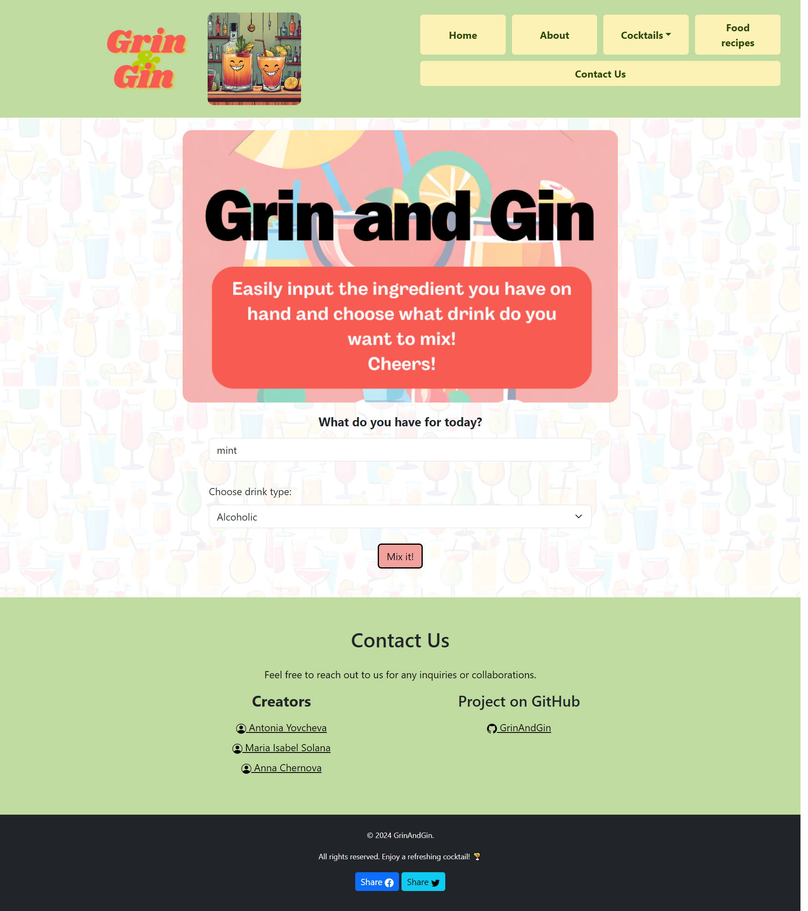

# GrinAndGin: Cocktail Matching Website

GrinAndGin is the app designed to simplify cocktail mixing and culinary pairing.

## Description

Grin And Gin was crafted by three novice web developers: Antonia Yovcheva, Maria Isabel Solana and Anna Chernova as part of the [EdX Skills Bootcamp in Front-End Web Development](https://www.edx.org/boot-camps/coding/skills-bootcamp-in-front-end-web-development).

The application offers a diverse range of cocktail recipes with both alcoholic and non-alcoholic options. It suggests meals to go with each drink, enables users to save their favorite combinations, and allows exploration of a variety of drink and food recipes.

## Features

1. ### Ingredient input

The user's journey begins by entering an alcoholic or non-alcoholic ingredient through the intuitive interface and selecting the desired drink type. Afterward, the user hits the "MixIt!" button to reveal a world of cocktails.

2. ### Quirky Cocktails

Grin And Gin algorithms analyze entered ingredient to provide users with a collection of cocktail cards, each accompanied by recipes and preparation instructions, that they can craft with the specified ingredient.

3. ### Food Pairing

Users get matching meal suggestions. They also can explore a dedicated page with all food recipes to choose something else.

4. ### Favorites

Users can easily add and remove cocktail recipes to their 'Favorites' with a click. Thanks to localStorage, all liked cocktails are stored on a dedicated page. Users can access their liked cocktails anytime, even after closing the browser, and also delete them from the list if no longer needed.

5. ### Inspiration Hub

Users can browse a variety of all cocktail recipes with the "All" section in the "Cocktails" menu.

6. ### Share with friends

An option to share the link to Grin and Gin website on personal Facebook and Twitter newsfeeds.

## Technologies used:

- **HTML (HyperText Markup Language):** The primary markup language for creating the structure of web pages.

- **CSS (Cascading Style Sheets):** Used for styling and visually formatting web pages, allowing customization of colors, fonts, layout.

- **Bootstrap:** A framework for developing responsive and stylish web applications, providing ready-made components, grids, styles.

- **jQuery:** A JavaScript library that simplifies interaction with HTML documents, event handling.

- **Bootstrap Icons:** Icons provided by Bootstrap for use in web applications, enhancing visual elements and improving the user experience.

- **API Integration:** Utilizing external APIs (such as [TheCocktailDB](https://www.thecocktaildb.com/api.php) and [TheMealDB](https://www.themealdb.com/api.php)) to dynamically retrieve cocktail recipes and match drinks with food items, enhancing the functionality and content of the web application.

## Project Screenshot

## Project Status

Deployed: [GrinAndGin website](https://anna702.github.io/GrinAndGin/).

## Credits

Online tutoring sessions - [EdX Skills Bootcamp in Front-End Web Development](https://www.edx.org/boot-camps/coding/skills-bootcamp-in-front-end-web-development).

Bespoke pictures, backgrounds and logo were created with [Canva](https://www.canva.com/) and AI-powered App [Magic Media](https://www.canva.com/en_gb/help/using-magic-media/).

Wireframe - [Excalidraw](https://excalidraw.com).

## Creators:

In case you have any questions, feel free to contact us:

- <a href="https://github.com/ToniY97"> Antonia Yovcheva </a>
- <a href="https://github.com/Joeviser"> Maria Isabel Solana </a>
- <a href="https://github.com/Anna702"> Anna Chernova </a>

## Project Presentation

GrinAndGin [presentation](https://drive.google.com/file/d/1pgN201-yN9mc7-Hu_cwGpsu22fNBMg_8/view?usp=sharing).

## License

This project is licensed under the MIT License.

## Acknowledgments

Hat tip to anyone who enjoys a good laugh with their cocktail.
Cheers to the open-source community for inspiration and support.
Let the mixing and grinning begin! 🍹✨
